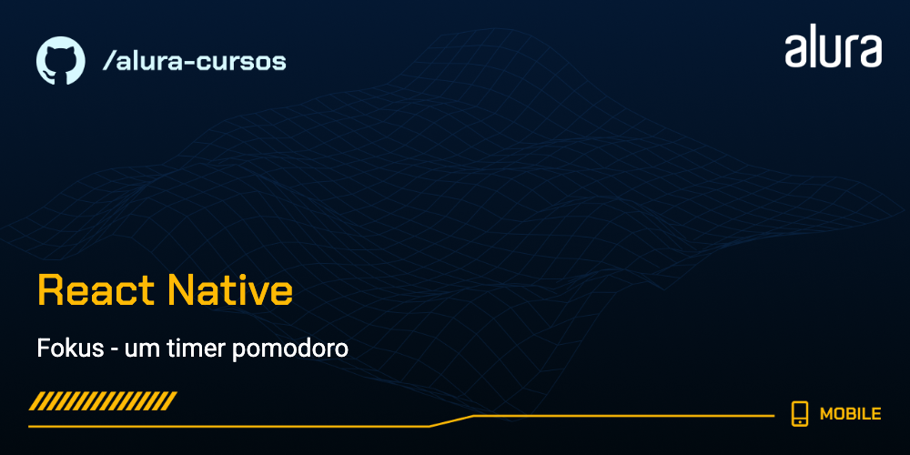
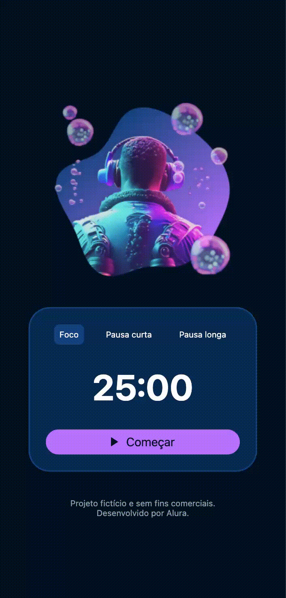

# Pomodoro App

Um projeto simples para introdução ao desenvolvimento com React Native, parte do curso voltado para quem já domina os fundamentos de ReactJS. Durante o curso, desenvolvemos gradualmente um app de Pomodoro.

## 🔨 Funcionalidades do projeto

- Seleção de diferentes modos de temporizador: Foco, Pausa Curta e Pausa Longa.
- Contador regressivo animado com opções de iniciar e pausar.
- Exibição de ícones interativos para controle do temporizador.



## ✔️ Técnicas e tecnologias utilizadas

O desenvolvimento do projeto envolve as seguintes tecnologias e técnicas:

- **`useState` e `useRef`**: Gerenciamento de estado e referência de intervalos.
- **Componentização**: Criação de componentes reutilizáveis como `FokusButton`, `ActionButton` e `Timer`.
- **`StyleSheet`**: Estilização customizada para layouts e interatividade.
- **Imagens e SVGs**: Utilização de imagens locais e ícones SVG personalizados.
- **`setInterval`**: Lógica de contagem regressiva com controle de interrupção.
- **React Native CLI**: Configuração e execução do projeto.
- **Simulação de Pomodoro**: Estrutura para foco e pausas integradas ao design.

## 🛠️ Abrir e rodar o projeto

Após baixar o projeto, siga os passos abaixo para executá-lo:

1. Certifique-se de que possui o ambiente de desenvolvimento React Native configurado ([guia oficial](https://docs.expo.dev/get-started/set-up-your-environment/)).

2. No terminal, navegue até a pasta do projeto e instale as dependências:

```bash
npm install
```

3. Execute o projeto:

```bash
npm start
```

4. Com o expo em execução, você pode abrir o app no seu navegador, em dispositivos virtuais (android | ios) ou no seu celular através do Expo Go

## 📚 Mais informações do curso

Gostou do projeto e quer aprender mais? Acesse o curso e desenvolva habilidades para criar aplicativos com React Native desde o início!
